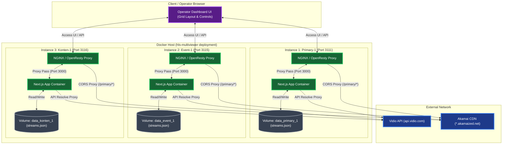
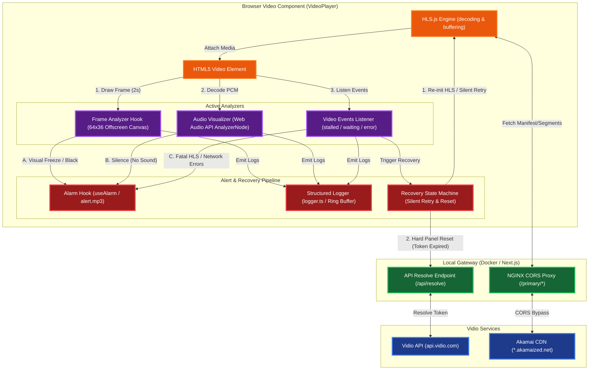

# HLS Multiviewer

A production-grade multiviewer application for monitoring multiple HLS (HTTP Live Streaming) video streams simultaneously, with real-time audio metering and a smart alarm system.

---

## Features

### Stream Management
- Display multiple concurrent video streams in a configurable grid layout
- Add, edit, and delete streams with server-side persistent storage (`streams.json`)
- Export stream configuration as JSON
- Import stream configuration from JSON — with a confirmation dialog that shows how many streams will be replaced
- Configurable grid layout (rows and columns)
- Per-stream play/pause controls
- Solo mode: expand a single stream to full view

### Playback & Quality
- Full HLS.js integration with Web Worker enabled for stable decoding
- Automatic quality switching: lowest quality in grid view, auto (highest) in solo mode
- Staggered stream startup to avoid simultaneous bandwidth spikes
- Programmatic autoplay fallback for browsers that block autoplay

### Audio Metering
- Real-time stereo L/R audio meter per stream using the Web Audio API
- Reads actual decoded PCM audio from the HLS stream (not simulated)
- Silence detection runs on a `setInterval` (100ms polling) — works correctly even when the browser tab is in the background

### Visual Stream Health
- **Canvas-based frame analysis**: captures video frames at 64×36 resolution every 2 seconds
- **Freeze detection**: compares consecutive frames — detects visual freezes that timecode-based stall detection misses (decoder stalls, corrupted segments)
- **Black frame detection**: computes average luminance per frame — detects broadcast blackouts and source feed failures while the stream is technically still playing

### Alarm System

Three distinct alert states with visual overlay + audible alarm:

#### Alert Triggers

| Alert | Detection | Condition | Triggers recovery? |
|---|---|---|---|
| **Video Stalled** | Timecode stall | `video.currentTime` hasn't advanced in 15+ seconds | Yes |
| **Video Stalled** | Silence + frozen | Audio silent AND `currentTime` stuck — escalates from No Sound | Yes |
| **Video Stalled** | Fatal HLS error | `levelParsingError`, media decode failure, or any fatal error → 10s timer | Yes |
| **Video Stalled** | Circuit breaker | 10+ consecutive non-fatal errors (502, network, buffer-seek-holes) | Yes |
| **Video Stalled** | Canvas freeze | 3+ identical frames while timecode advances (canvas capture at 64×36, every 2s) | Yes |
| **Video Black** | Canvas luminance | Average frame luminance < threshold (2%) for 10+ continuous seconds | No |
| **No Sound** | Audio RMS | Audio level below RMS threshold for 10+ seconds while video is actively playing | No |

#### Per-Panel Hard Reset Triggers

When the entire player remounts with a fresh URL resolve and cache-busted proxy URL:

| Trigger | Condition |
|---|---|
| HTTP 403 | Token expired on the main HLS instance |
| HTTP 403 | Token expired on the recovery loop instance |
| `levelParsingError` | CDN returned corrupt content (HTML error page, truncated M3U8) |

#### Alert Priority

```
Video Stalled (highest) → Video Black → No Sound (lowest)
```

#### Recovery Behavior

- **Recovery loop** runs every 5 seconds when "Video Stalled" — on each attempt, HLS.js is **fully destroyed and recreated** (same as browser refresh)
- **Per-panel hard-reset**: HTTP 403 and level parsing errors trigger immediate `internalReloadCount` increment — the panel remounts with fresh URL resolve + `?panelReload=N` cache busting
- **Cross-stream error correlation**: when >50% of streams share the same HTTP error (e.g. 502) within 30s, a yellow banner appears (e.g. "Proxy unreachable (502)"). Recovery loops still run independently — the banner suppresses noise, not recovery
- 403 errors trigger immediate hard-reset — no retry spam on an expired token
- Alarm sound can be muted per-stream via the bell icon

---

## Architecture

### Network & Deployment Topology



### Stream Resolution, Playback & Alert Pipeline



### Multi-Dashboard Deployment

The project supports multiple isolated dashboard instances, each with its own:
- Dedicated port
- Isolated Docker volume (stream data does not bleed between instances)
- NGINX reverse proxy that also proxies HLS segment requests to bypass browser CORS restrictions

| Instance | Port | Data Volume |
|---|---|---|
| `primary-1` | `3111` | `./data_primary_1` |
| `event-1` | `3115` | `./data_event_1` |
| `konten-1` | `3116` | `./data_konten_1` |

### NGINX Proxy

Each instance runs an OpenResty (NGINX) proxy at the public port. It:
1. Forwards all UI/API requests to the Next.js app container
2. Proxies HLS CDN requests (e.g. `/primary/`, `/geo-id/`, `/hls-b/`) to Akamai on the server side, which avoids browser CORS restrictions for tokenized stream URLs

### Stream URL Formats

| Format | CORS Extension Needed? |
|---|---|
| Direct Akamai URL (`https://etslive-...akamaized.net/...`) | ✅ Yes — browser sees it as cross-origin |
| Proxied URL (`/primary/etslive-...`) | ❌ No — browser sees it as same-origin, NGINX handles the rest |

**Use the proxied format** (starting with `/primary/`, `/geo-id/`, etc.) whenever possible to avoid needing a CORS browser extension.

---

## Installation

### Local Development

```bash
git clone https://github.com/visual-alchemy/hls-multiviewer-release.git
cd hls-multiviewer-release
npm install
npm run dev
```

> If you encounter peer dependency conflicts:
> ```bash
> npm install --legacy-peer-deps
> ```

Open your browser at `http://localhost:3111`.

---

### Docker (Single Instance)

```bash
# Build
docker build -t hls-multiviewer .

# Run
docker run -d -p 3111:3111 -v $(pwd)/data:/app/data hls-multiviewer
```

---

### Docker Compose (Multi-Instance)

```bash
# Start all instances (primary-1, event-1, konten-1)
docker compose up -d

# Start specific instance only
docker compose up -d app-primary-1 proxy-primary-1

# Clean rebuild (required after code changes)
docker compose down
docker compose build --no-cache
docker compose up -d

# Quick rebuild (same as above but without stopping first)
docker compose up -d --build
```

Each instance's stream configuration is stored in its respective `./data_<name>/streams.json` file and persists across container restarts.

#### Log Management

Docker log rotation is configured per container:
- **Max file size**: 10 MB
- **Max files**: 3 (rotated)
- **Max total per container**: ~30 MB

To manually clean existing large log files without restarting:
```bash
sudo truncate -s 0 /var/lib/docker/containers/<container-id>/<container-id>-json.log
```

---

## Usage

1. **Add streams** using the `+` button — provide a title and an HLS URL (`.m3u8`)
2. **Import** a JSON configuration using the upload icon — a confirmation dialog will show how many streams will be replaced
3. **Export** the current configuration using the download icon
4. **Solo** a stream by clicking the expand icon — this switches to high quality and fills the view
5. **Mute/unmute** all streams globally, or mute alarm sounds per-stream via the bell icon
6. **Configure the grid** layout using the grid icon

---

## Technologies

- **Next.js 14** (App Router)
- **React** + **TypeScript**
- **HLS.js** — HLS playback with Web Worker
- **Web Audio API** — real-time stereo audio metering
- **OpenResty / NGINX** — reverse proxy + HLS CORS proxy
- **Docker / Docker Compose** — multi-instance orchestration
- **Tailwind CSS** + **shadcn/ui**

---

## License

This project is licensed under the [Apache 2.0 License](https://github.com/visual-alchemy/hls-multiviewer-release/blob/main/LICENSE.txt).
